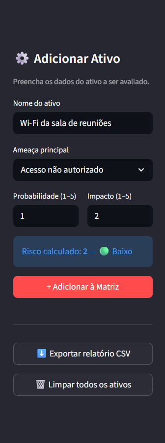
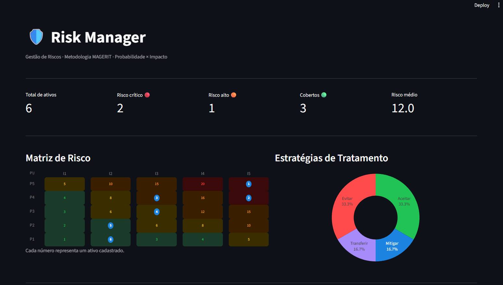
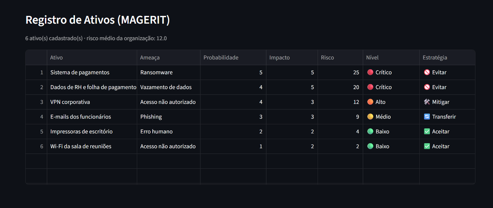
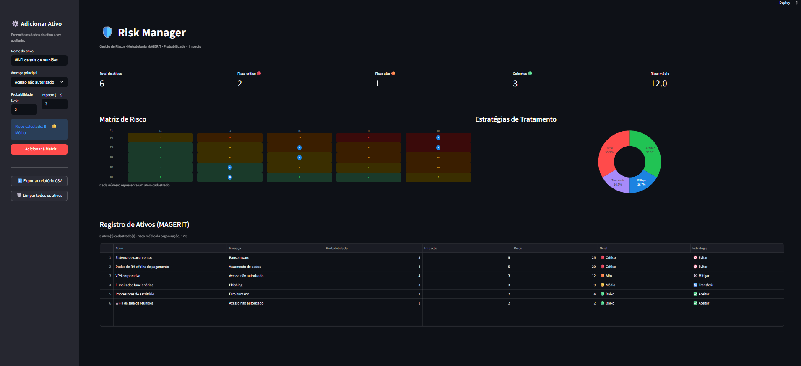
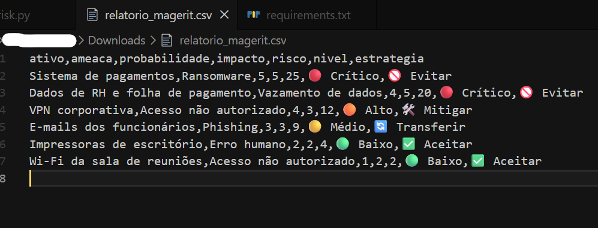

<p align="center">
  
</p>

<p align="center">
  
  
  
  
</p>

---

## 📖 Sobre a Origem do Projeto

Este é o **quinto e último projeto** de uma série desenvolvida como aplicação prática do curso **CIBERSEGURIDAD APLICADA: REGLAMENTOS, INTELIGENCIA Y DEFENSA**.

> Este curso é oferecido pelo **CIBERIA**, um projeto coordenado pela **Universidade de Salamanca**, que visa a digitalização e segurança de empresas e organismos públicos na região de Castela e Leão e no centro de Portugal (zona CENCYL).

---

## 🎯 O Porquê deste Projeto (Justificativa)

A **Gestão de Riscos** é um dos pilares fundamentais da cibersegurança. Na prática, nenhuma organização tem recursos para proteger tudo de forma igual — é preciso priorizar.

O **Risk Manager** foi construído para tornar esse processo visual e acessível. Em vez de planilhas confusas, o analista cadastra os ativos da organização, define probabilidade e impacto de cada ameaça, e o dashboard monta automaticamente a matriz de riscos com as estratégias de tratamento recomendadas.

### Conceitos aplicados
* **Metodologia MAGERIT:** estrutura oficial de análise de riscos utilizada em administrações públicas espanholas e ambientes que seguem o Esquema Nacional de Segurança.
* **Cálculo de Risco:** `Risco = Probabilidade × Impacto` — quanto maior o resultado, maior a prioridade de ação.
* **4 Estratégias de Tratamento:** Aceitar (risco baixo), Transferir (médio), Mitigar (alto) e Evitar (crítico) — definidas automaticamente pelo sistema com base no valor calculado.
* **Exportação de Relatório:** geração de arquivo CSV com todos os ativos e suas classificações, pronto para ser utilizado em auditorias ou apresentações.

---

## 💻 Demonstração Visual

**Painel lateral - cadastro de ativo com preview do risco em tempo real:**

<p align="center">
  
</p>

**Dashboard principal - métricas, matriz de risco e gráfico de estratégias:**

<p align="center">
  
</p>

**Registro de Ativos (MAGERIT) - tabela completa com nível e estratégia por ativo:**

<p align="center">
  
</p>

**Visão geral com sidebar aberta:**

<p align="center">
  
</p>

**Exportação do relatório em CSV - dados prontos para auditoria:**

<p align="center">
  
</p>

---

## 🚀 Como Executar Localmente

**1. Clonar o repositório:**
```bash
git clone https://github.com/suares13/risk-manager.git
```

**2. Acessar a pasta do projeto:**
```bash
cd risk-manager
```

**3. Instalar as dependências:**
```bash
pip install -r requirements.txt
```

**4. Executar o dashboard:**
```bash
python -m streamlit run risk.py
```

O app abre automaticamente no navegador em `http://localhost:8501`.

---

## 👩‍💻 Autora

**Victória Santos Suares da Silva**
*Estudante de Engenharia de Software e Pesquisadora em IA Justa e Transparente.*
Foco em Segurança Ofensiva, Análise de Vulnerabilidades e Ciberdireito.

* **LinkedIn:** https://www.linkedin.com/in/victoria-suares/
* **GitHub:** [@suares13](https://github.com/suares13)
